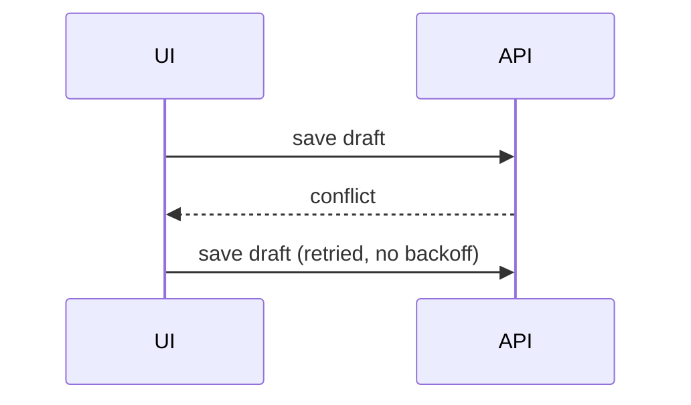

A **finding** is one claim about the PR: where it applies, what's wrong, and why it matters. **Triage** sorts every finding onto a **disposition** before a word of the review is written. The review lands as a **pending review**, visible only to the user until they submit it from GitHub.

## Steps

### 1. Establish the PR

Take the PR from the invocation; otherwise ask. Read its title, body, base, head SHA, and every existing review thread, from any reviewer.

Every pass reviews the head SHA against its merge-base with the base branch.

Done when you hold the PR's head SHA, its base, and its existing threads.

### 2. Choose the passes

Detect which passes apply:

- `/code-review` at `high` effort: always.
- `/mattpocock-skills:code-review`: always. It finds the spec itself.
- `/browser-qa`: when the app is browser-driven and the diff touches something a user sees.

Confirm with one multiSelect AskUserQuestion that lists every pass, marking the ones that apply as recommended, each with a one-line reason.

Done when the user has chosen the passes.

### 3. Run the passes

Dispatch each chosen pass as its own sub-agent, all in parallel. Each brief carries the range from step 1, names the skill to invoke, and asks for the findings back as a list: file, line (or none), one-line claim, why it matters. A `/browser-qa` brief asks for each failure as steps to reproduce, expected against actual.

While the passes run, tell the user they can add **notes** of their own, a `file:line` and a rough remark, at any point before step 6. Each note is a finding with the disposition **keep**.

Done when every pass has returned its list. A reply without the list means the pass is still working: message it to finish and send the list.

### 4. Collect

Merge the lists into one, collapsing findings that make the same claim. Compare each finding with the existing threads: one that repeats a thread is tagged with who raised it, and its recommended disposition is **discard**.

Done when every finding from every pass is on the list exactly once.

### 5. Triage

Judge each finding on its face, from what it claims and what you already know. Present it as a one-line summary with its location, and offer the four dispositions that fit it best, your recommendation first (AskUserQuestion, one finding per question, four per call). Work through every finding this way, however many there are.

- **keep**: valid; it goes in the review.
- **ask the author**: the user suspects a problem but can't show it; it goes in the review as a question.
- **discard**: invalid, already raised, or not worth the author's time.
- **investigate** _(interim)_: a sub-agent reads the code to confirm whether the finding holds.
- **explain** _(interim)_: a sub-agent reads the code and explains the finding so the user can decide.

Dispatch one sub-agent per interim finding, in parallel. As each reports, relay what it found and triage that finding again.

Done when every finding is **keep**, **ask the author**, or **discard**.

### 6. Write the comments

Ask the user once whether they have notes still to add. Then load `/humanize`: every word of the review follows it.

Write a comment for each **keep** and **ask the author** finding:

- **Anchor** it on the line that owns it: the line where the cause sits, inside the diff's hunks (GitHub accepts anchors only there). Anchor a range, `start_line` to `line`, when a suggestion replaces several lines.
- A finding with no owning line goes in the review body. The body holds those findings and nothing else, so it is empty when everything anchors.
- Write as the user, a teammate talking to the author: first person where it's natural, the problem, why it matters, and what to do about it.
- Phrase an **ask the author** finding as the question the user wants answered.
- Give a `/browser-qa` failure as its steps to reproduce, expected against actual.
- Show the point with the smallest shape that makes it clear (see **Shapes**), next to the sentence it supports.

Done when every **keep** and **ask the author** finding has a comment or a place in the body.

### 7. Draft the review

Create the pending review in one call: `gh api repos/<owner>/<repo>/pulls/<number>/reviews` with `commit_id` set to the head SHA from step 1, `body`, and a `comments[]` array of `{path, line, side: "RIGHT", body}`, adding `start_line` for a range. Omit `event`: that is what keeps the review pending.

Done when the pending review exists on the PR.

### 8. Report

Recommend a **mode** by asking whether merging the PR as it stands would do harm:

- **Request changes**: a **keep** finding would do harm on merge: a bug, a missed requirement, a risk to data.
- **Comment**: no **keep** finding would, but an **ask the author** question could reveal one.
- **Approve**: what remains is optional.

On the user's own PR, GitHub offers only Comment, so recommend Comment.

Report the PR's link, the recommended mode, and a one-line reason for it.

Done when the user holds the link and the recommendation.

## Shapes

Pick the smallest view that makes the point. Most comments need none; a few need one.

- A simple fix, complete as written and confined to the anchored lines, as a GitHub suggestion the author applies in one click:

````md
```suggestion
const timeout = options.timeout ?? DEFAULT_TIMEOUT
```
````

- Logic or an algorithm as pseudocode:

```text
on(save)
  if content is unchanged
    return cached result
  write new content
  return fresh result
```

- Runtime control flow as a call tree:

```text
submitForm
  createSession
    persistPrompt
    launchAgent
  navigateToSession
```

- UI structure as a component tree, with the state and module boundaries that matter:

```text
<SessionPage> (apps/example/src/routes/session.tsx)
  useSessionEvents()
  <SessionToolbar>
    <RunSkillButton> (packages/ui)
```

- File responsibility as a shallow file tree:

```text
src/
├── commands/       # parses user actions
├── sessions/       # owns session state
└── transport/      # sends API requests
```

- Component interaction or data flow as Mermaid:



- A change to a shape that already exists as a `diff` of that shape, a call tree for a call-order change, pseudocode for a control-flow change:

```diff
 on(save)
-  write content
+  if content is unchanged
+    return cached result
+  write new content
+  invalidate cache
```

- The whole block when most of it would change, when omitted context would hide ownership or order, or when the author needs a copyable target.
