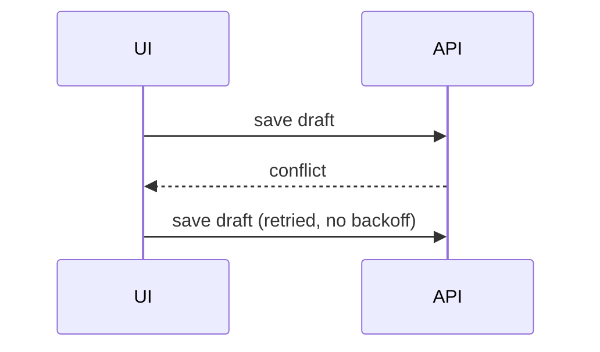

# Shapes

- A simple fix, complete as written and confined to the anchored lines, as a GitHub suggestion the author applies in one click:

````md
```suggestion
const timeout = options.timeout ?? DEFAULT_TIMEOUT
```
````

- Logic or an algorithm as pseudocode:

```text
on(save)
  if content is unchanged
    return cached result
  write new content
  return fresh result
```

- Runtime control flow as a call tree:

```text
submitForm
  createSession
    persistPrompt
    launchAgent
  navigateToSession
```

- UI structure as a component tree, with the state and module boundaries that matter:

```text
<SessionPage> (apps/example/src/routes/session.tsx)
  useSessionEvents()
  <SessionToolbar>
    <RunSkillButton> (packages/ui)
```

- File responsibility as a shallow file tree:

```text
src/
├── commands/       # parses user actions
├── sessions/       # owns session state
└── transport/      # sends API requests
```

- Component interaction or data flow as Mermaid:



- A change to a shape that already exists as a `diff` of that shape, a call tree for a call-order change, pseudocode for a control-flow change:

```diff
 on(save)
-  write content
+  if content is unchanged
+    return cached result
+  write new content
+  invalidate cache
```

- The whole block when most of it would change, when omitted context would hide ownership or order, or when the author needs a copyable target.
