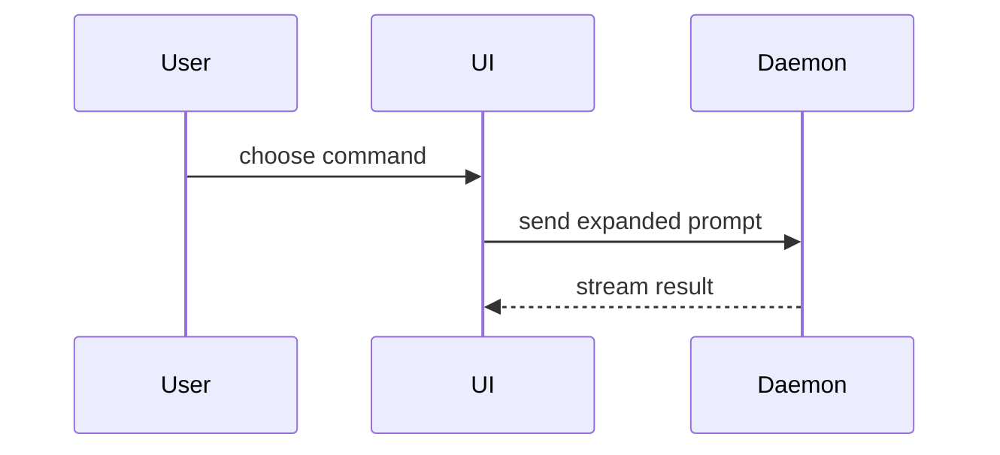

# Recipes

How to render one point. Each is a **proof**.

## Pseudocode

Logic or an algorithm, where the branches matter and the syntax doesn't.

```text
on(save)
  if content is unchanged
    return cached result
  write new content
  return fresh result
```

## Call tree

Runtime control flow: what calls what, in order.

```text
submitForm
  createSession
    persistPrompt
    launchAgent
  navigateToSession
```

## Component tree

UI structure, carrying the state and module boundaries that matter.

```tsx
<SessionPage> (apps/example/src/routes/session.tsx)
  useSessionEvents()
  <SessionToolbar>
    <RunSkillButton> (packages/ui)
```

## File tree

File responsibility, or the shape of a broad refactor. One line of purpose per entry.

```text
src/
├── commands/       # parses user actions
├── sessions/       # owns session state
└── transport/      # sends API requests
```

## Diff

What changes, when the surrounding shape already exists. Match the diff's shape to the topic — diff a component tree for a UI change, a file tree for a layout change, a call tree for a call-order change, pseudocode for a control-flow change:

```diff
 on(save)
-  write content
+  if content is unchanged
+    return cached result
+  write new content
+  invalidate cache
```

Show the whole block instead when most of it is new, when the omitted context would hide ownership or order, or when the user needs a copyable target shape.

## Mermaid

Component interaction, data flow, and state machines. Inline, favor sequence diagrams — their source reads cleanly on its own.



## Hand-drawn SVG

**Artifact only.** For content Mermaid's auto-layout fights: spatial relationships, overlays, a graph too dense for Mermaid source, anything whose position on the page carries meaning. Drawn per `/artifact-diagramming`.

## Capture

**Artifact only.** A screenshot of the real app, driven through the flow being shown.

- One capture per step of the flow, in sequence.
- Caption each with what the user just did and what changed on screen.
- Resize and compress before embedding — the finished page has to be small enough to share.
- Embed as a data URI, so the page stays self-contained.
